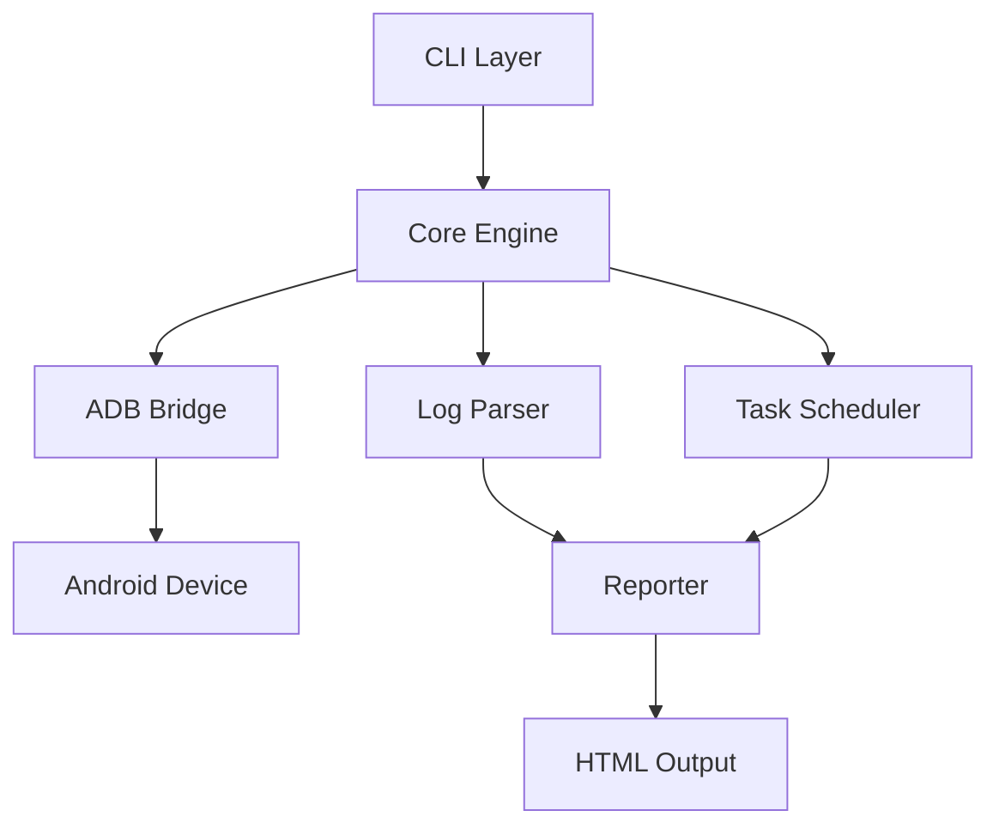

## 整体架构

命令行解析、参数校验、帮助系统、子命令分发

=== slot ===

设备发现与管理、任务调度、状态机、插件系统

=== slot ===

HTML 报告输出、JSON 格式化、实时日志、性能统计

<!-- reader -->
Android CLI 采用经典的三层架构：

**CLI 入口层**负责与用户交互，解析命令行参数，提供
完整的帮助系统。它支持子命令模式——每个功能模块
（如设备管理、日志收集）作为一个独立的子命令，
通过统一的入口调用。

**Core 引擎层**是整个系统的核心。它管理设备发现
（通过 ADB Bridge 与设备通信）、任务调度
（并发执行多个操作）、以及状态管理。插件系统
允许第三方扩展功能，而无需修改核心代码。

**Reporter 输出层**将收集到的数据转化为可读的报告。
支持 HTML 格式（适合分享和存档）、JSON 格式
（适合程序化处理）、以及实时终端日志（适合调试）。
<!-- /reader -->
